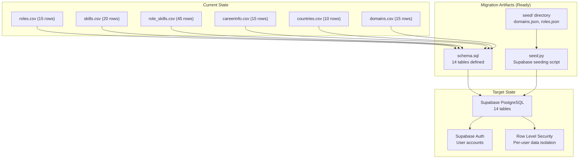
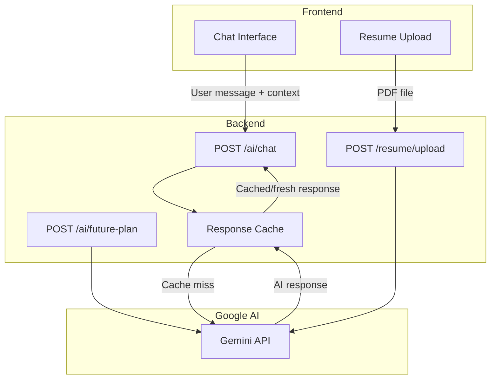
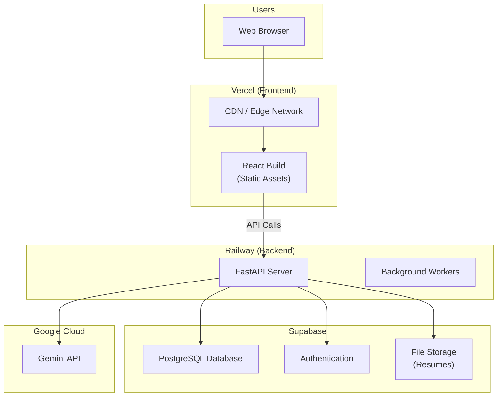

# 🧭 Pathloom — Architecture & Technical Decisions

> Version 1.0 · July 2026  
> Status: Living Document

---

## 1. Overview

This document records key architectural decisions (ADRs), technical strategies, and the evolution plan for Pathloom's infrastructure. It serves as a reference for understanding *why* specific technology choices were made and *how* the system will evolve.

---

## 2. Architectural Decision Records (ADRs)

### ADR-001: Client-Server Architecture with Decoupled Frontend/Backend

**Status:** Accepted  
**Date:** June 18, 2026  

**Context:** Pathloom needs a web-based platform with rich UI interactions and backend intelligence computation. The project will eventually be deployed with separate hosting for frontend and backend.

**Decision:** Use a decoupled architecture with React (Vite) frontend and Python (FastAPI) backend communicating over REST/HTTP.

**Rationale:**
- React provides a rich, interactive SPA experience ideal for dashboards and data visualization
- FastAPI offers high performance with async support and auto-generated API docs
- Separation allows independent deployment (Vercel for frontend, Railway for backend)
- Python ecosystem is stronger for data processing, scoring algorithms, and future ML/AI integration
- Team has stronger Python skills for intelligence logic

**Consequences:**
- CORS configuration required between frontend and backend
- Two separate deployment pipelines needed
- API contract must be well-documented and versioned

---

### ADR-002: CSV Flat Files as Initial Data Store

**Status:** Accepted (transitioning to PostgreSQL)  
**Date:** June 18, 2026  

**Context:** The project needed to get a working prototype quickly. The initial dataset is small (< 100 records total).

**Decision:** Start with CSV files for data storage, with a planned migration to PostgreSQL.

**Rationale:**
- Zero infrastructure setup — no database server needed for development
- Easy to inspect and edit data manually during rapid prototyping
- Git-trackable — data changes visible in version control
- Sufficient for the current data volume (~100 records across 6 files)

**Consequences:**
- No relational integrity enforcement
- No concurrent write support
- Data loaded entirely into memory at startup
- Must migrate to PostgreSQL before production deployment
- Migration plan: CSV → Supabase PostgreSQL (schema and seed scripts already created)

---

### ADR-003: Weighted Importance Scoring Algorithm

**Status:** Accepted  
**Date:** June 18, 2026  

**Context:** The readiness score is Pathloom's core metric. A simple "skills you have / skills required" percentage doesn't capture that some skills are more critical than others.

**Decision:** Use weighted importance scoring where each skill-role mapping has an importance value (1-10), and the readiness score is `earned_importance_points / total_importance_points × 100`.

**Rationale:**
- More nuanced than simple count-based scoring
- Captures the reality that core skills (e.g., Python for Data Engineering) matter more than supplementary skills (e.g., Git)
- Importance weights are easily adjustable per role
- Simple enough to explain to users, sophisticated enough to be useful

**Consequences:**
- Requires careful calibration of importance weights
- Score can seem counter-intuitive when a user has many low-importance skills but misses high-importance ones
- Future enhancement: add skill proficiency levels (beginner/intermediate/expert) for even finer granularity

> See [Scoring Algorithm Design](./scoring.md) for full technical details.

---

### ADR-004: Monolithic Frontend with Planned Decomposition

**Status:** Accepted (tech debt — refactoring planned)  
**Date:** June 19, 2026  

**Context:** During rapid prototyping (Days 1-3), all frontend features were built in a single `App.jsx` file to maximize development speed.

**Decision:** Ship with a monolithic `App.jsx` (~2,500 lines) now; refactor into modular components with React Router in Phase 4.

**Rationale:**
- Fastest path to a working prototype during the 40-day build sprint
- All features share significant state (selected role, skills, academic profile)
- Component boundaries weren't clear until features stabilized
- Refactoring before features are stable leads to wasted effort

**Consequences:**
- `App.jsx` is now 2,500+ lines — difficult to navigate and maintain
- No URL routing — users can't bookmark specific views
- No code splitting — entire app loads as one bundle
- Planned remediation: React Router + component extraction in Phase 4 (Days 34-36)

**Refactoring Plan:**
```
src/
├── pages/
│   ├── CareerAnalysis.jsx
│   ├── CareerRecommend.jsx
│   ├── CareerCompare.jsx
│   ├── StudyProfile.jsx
│   ├── UniversityFinder.jsx
│   ├── ScholarshipMatch.jsx
│   └── CountryStrategy.jsx
├── components/
│   ├── Header.jsx
│   ├── ModeToggle.jsx
│   ├── ThreadGauge.jsx
│   ├── SkillChip.jsx
│   ├── RoleCard.jsx
│   ├── ComparisonChart.jsx
│   └── ComparisonTable.jsx
├── hooks/
│   ├── useCareerProfile.js
│   ├── useAcademicProfile.js
│   └── useAPI.js
├── data/
│   ├── countries.js
│   ├── universities.js
│   └── scholarships.js
└── App.jsx (Router only)
```

---

### ADR-005: Template-Based AI with Planned LLM Integration

**Status:** Accepted (transitioning to Gemini API)  
**Date:** June 19, 2026  

**Context:** The "AI Insights" feature needs to provide contextual career guidance. A real LLM integration takes time to build, test, and handle rate limits/costs.

**Decision:** Launch with template-based text generation (string interpolation using matched/missing skills). Replace with Gemini API after core features are stable.

**Rationale:**
- Instant response times (no API latency)
- No API costs during development
- Allows frontend UX to be built and tested without AI dependency
- Template quality is acceptable for MVP

**Consequences:**
- "AI" features are not actually AI — just string templates
- Insights feel generic and repetitive
- Must integrate Gemini API for production quality
- Integration plan: Phase 3, Days 24-26

**Current template example:**
```python
f"You already possess skills such as {matched_text}. "
f"Learning {missing_text} could significantly improve your readiness for a {role_name} role."
```

---

### ADR-006: Supabase as Database Platform

**Status:** Accepted (not yet implemented)  
**Date:** June 20, 2026  

**Context:** PostgreSQL migration needed. Options: self-hosted PostgreSQL, AWS RDS, PlanetScale, Supabase, Neon.

**Decision:** Use Supabase (PostgreSQL) for database, authentication, and Row Level Security.

**Rationale:**
- Free tier sufficient for launch
- Built-in authentication (email, OAuth) — saves building auth from scratch
- Row Level Security (RLS) for data access control
- RESTful API auto-generated from schema
- Real-time subscriptions (useful for future features)
- Hosted PostgreSQL — no database administration needed
- Good Python SDK for seed scripts

**Consequences:**
- Vendor dependency on Supabase
- Schema must use UUIDs (Supabase convention) instead of integer IDs
- RLS policies add complexity but improve security
- Seed scripts already created (`backend/seed.py`, `database/seed/`)

---

### ADR-007: Tailwind CSS 4 for Styling

**Status:** Accepted  
**Date:** June 19, 2026  

**Context:** The frontend needs a CSS framework. Options: vanilla CSS, CSS Modules, Tailwind CSS, styled-components, MUI.

**Decision:** Use Tailwind CSS 4 with a custom design system ("Thread Gauge").

**Rationale:**
- Rapid UI development with utility classes
- Custom design tokens (colors, fonts) configured via Tailwind config
- v4 offers improved performance and new CSS features
- Large ecosystem and community
- Consistent with modern React development practices

**Consequences:**
- HTML is verbose with many utility classes
- Custom design system requires careful configuration
- Some complex UI patterns need custom CSS alongside Tailwind

---

## 3. Database Migration Strategy

### 3.1 Migration Plan: CSV → Supabase PostgreSQL



### 3.2 Migration Steps

| Step | Task | Status |
|------|------|--------|
| 1 | Design PostgreSQL schema | ✅ Done (`database/schema.sql`) |
| 2 | Create seed data files | ✅ Done (`database/seed/*.json`) |
| 3 | Build seeding script | ✅ Done (`backend/seed.py`) |
| 4 | Set up Supabase project | 🔲 Not started |
| 5 | Run schema migration | 🔲 Not started |
| 6 | Seed initial data | 🔲 Not started |
| 7 | Update backend loaders to query PostgreSQL | 🔲 Not started |
| 8 | Add connection pooling | 🔲 Not started |
| 9 | Migrate frontend static data to database | 🔲 Not started |
| 10 | Decommission CSV files | 🔲 Not started |

### 3.3 Schema Changes: CSV → PostgreSQL

| CSV (Current) | PostgreSQL (Target) | Key Differences |
|--------------|-------------------|-----------------|
| Integer IDs (`1`, `2`, ...) | UUIDs (`uuid_generate_v4()`) | IDs will change format |
| No relations enforced | Foreign keys with cascade | Referential integrity |
| No timestamps | `created_at TIMESTAMPTZ` on all tables | Audit trail |
| 6 flat files | 14 normalized tables | More granular data model |
| No auth | `user_profiles` with RLS | Per-user data security |

---

## 4. AI Integration Architecture (Planned)

### 4.1 Gemini API Integration Plan



### 4.2 AI-Powered Features

| Feature | Prompt Strategy | Fallback |
|---------|---------------|----------|
| **AI Career Coach** | System prompt with user profile context + career data | Template-based insights |
| **AI Study Coach** | System prompt with academic profile + university data | Static guidance text |
| **Resume Analysis** | Extract skills from PDF text → match against skill catalog | Manual skill selection |
| **AI Future Planner** | Combined profile → structured plan generation | Pre-built plan templates |
| **AI Resume Feedback** | Resume text → improvement suggestions | Generic resume tips |

---

## 5. Deployment Architecture (Planned)



### Deployment Configuration

| Service | Plan | Estimated Cost |
|---------|------|---------------|
| **Vercel** | Hobby (Free) | $0/month |
| **Railway** | Starter | ~$5/month |
| **Supabase** | Free tier | $0/month |
| **Gemini API** | Pay-per-use | ~$10-30/month |
| **GitHub** | Free | $0/month |
| **Total** | — | **~$15-35/month** |

---

## 6. Technical Debt Inventory

| ID | Issue | Severity | Remediation | Phase |
|----|-------|----------|-------------|-------|
| TD-01 | Monolithic `App.jsx` (2,500 lines) | 🔴 High | Decompose into pages/components with React Router | Phase 4 |
| TD-02 | CSV flat file database | 🔴 High | Migrate to Supabase PostgreSQL | Phase 3 |
| TD-03 | No authentication | 🟡 Medium | Add Supabase Auth | Phase 4 |
| TD-04 | CORS wildcard (`*`) | 🟡 Medium | Restrict to deployment domains | Phase 4 |
| TD-05 | Zero test coverage | 🟡 Medium | Add pytest (backend) + component tests (frontend) | Phase 4 |
| TD-06 | Template-based "AI" | 🟡 Medium | Integrate Gemini API | Phase 3 |
| TD-07 | Incomplete role-skill data | 🟡 Medium | Complete mappings for all 15 roles | Phase 2 |
| TD-08 | Frontend data duplication | 🟠 Low | Move study data to backend API | Phase 3 |
| TD-09 | No error boundaries | 🟠 Low | Add React error boundaries | Phase 4 |
| TD-10 | No React Router | 🟠 Low | Add routing in Phase 4 refactor | Phase 4 |
| TD-11 | No API rate limiting | 🟠 Low | Add rate limiting for AI endpoints | Phase 4 |

---

## 7. Scalability Considerations

### Current Limits

| Dimension | Current Capacity | Bottleneck |
|-----------|-----------------|------------|
| **Concurrent Users** | ~100 (single Uvicorn worker) | Single process, in-memory data |
| **Data Volume** | ~100 records | CSV files loaded at startup |
| **AI Throughput** | Unlimited (templates) | Will be limited by Gemini API rate |
| **Frontend Load** | ~113KB bundle | No code splitting |

### Scaling Strategy (When Needed)

1. **Backend:** Multiple Uvicorn workers → Gunicorn with worker processes
2. **Database:** Supabase free tier → Pro tier ($25/month for larger datasets)
3. **AI:** Implement response caching + request queuing for Gemini API
4. **Frontend:** Code splitting + lazy loading via React Router
5. **CDN:** Vercel Edge Network handles static asset distribution

---

> **Document Owner:** Pathloom Development Team  
> **Last Updated:** July 3, 2026
