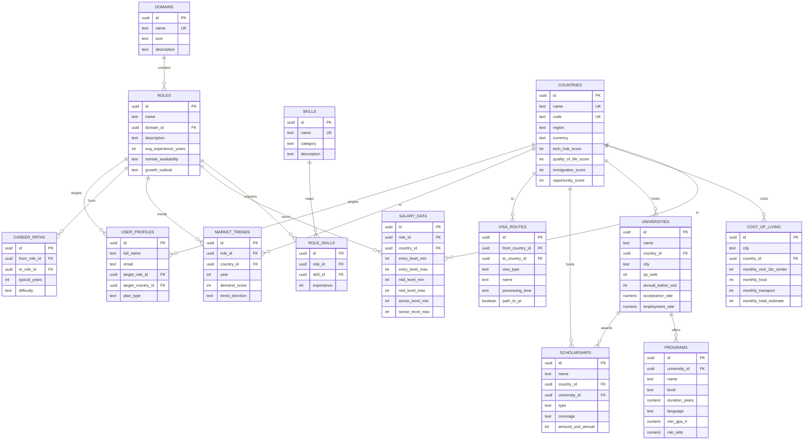

# 📊 Pathloom — Data Dictionary

> Version 1.0 · July 2026  
> Status: Living Document

---

## Overview

This document provides a comprehensive reference for all data models in Pathloom — including the current CSV flat files, the planned PostgreSQL schema, and the frontend static data structures.

---

## 1. Current Data Layer (CSV Flat Files)

All CSV files are located in the `database/` directory and are loaded into memory at server startup by dedicated loader modules.

### 1.1 `roles.csv` — Career Role Catalog

**Loaded by:** `backend/role_loader.py` → `load_roles()`  
**Records:** 15  
**In-memory structure:** `List[Dict]`

| Column | Type | Description | Example |
|--------|------|-------------|---------|
| `role_id` | string | Unique role identifier | `"2"` |
| `role_name` | string | Human-readable role name | `"Data Engineer"` |
| `domain_id` | string | Foreign key to domains.csv | `"1"` |

**Coverage by Domain:**

| Domain ID | Domain | Roles |
|-----------|--------|-------|
| 1 | AI & Data | Data Analyst (1), Data Engineer (2), ML Engineer (3), AI Engineer (4), Data Scientist (5), Business Analyst (6) |
| 2 | Software Development | Frontend Developer (7), Backend Developer (8), Full Stack Developer (9), Mobile Developer (10) |
| 3 | Cloud Computing | DevOps Engineer (11), Cloud Engineer (12), Cloud Architect (13) |
| 4 | Cybersecurity | Cybersecurity Analyst (14), Security Engineer (15) |

---

### 1.2 `skills.csv` — Technical Skill Catalog

**Loaded by:** `backend/skill_loader.py` → `load_skills()`  
**Records:** 20  
**In-memory structure:** `Dict[str, str]` (skill_id → skill_name)

| Column | Type | Description | Example |
|--------|------|-------------|---------|
| `skill_id` | string | Unique skill identifier | `"1"` |
| `skill_name` | string | Human-readable skill name | `"Python"` |

**Complete Skill List:**

| ID | Skill | ID | Skill |
|----|-------|----|-------|
| 1 | Python | 11 | Docker |
| 2 | SQL | 12 | AWS |
| 3 | Excel | 13 | Git |
| 4 | Pandas | 14 | JavaScript |
| 5 | NumPy | 15 | React |
| 6 | Machine Learning | 16 | Node.js |
| 7 | Deep Learning | 17 | HTML |
| 8 | PyTorch | 18 | CSS |
| 9 | TensorFlow | 19 | Statistics |
| 10 | Spark | 20 | Data Visualization |

---

### 1.3 `role_skills.csv` — Role-Skill Mappings

**Loaded by:** `backend/data_loader.py` → `load_role_skills()`  
**Records:** 45  
**In-memory structure:** `Dict[str, List[Dict]]` (role_id → list of {skill_id, importance})

| Column | Type | Description | Example |
|--------|------|-------------|---------|
| `role_id` | string | Foreign key to roles.csv | `"2"` |
| `skill_id` | string | Foreign key to skills.csv | `"1"` |
| `importance` | integer | Skill importance weight (1–10) | `10` |

**Importance Scale:**

| Weight | Meaning |
|--------|---------|
| 10 | Absolutely essential — role cannot function without this |
| 7–9 | Highly important — expected in most job listings |
| 4–6 | Valuable — improves candidate profile significantly |
| 1–3 | Nice to have — differentiator but not required |

**Data Coverage:**

| Role ID | Role Name | Mappings | Status |
|---------|-----------|----------|--------|
| 1 | Data Analyst | ✅ Has mappings | Complete |
| 2 | Data Engineer | ✅ Has mappings | Complete |
| 3 | ML Engineer | ✅ Has mappings | Complete |
| 4 | AI Engineer | ✅ Has mappings | Complete |
| 5 | Data Scientist | ✅ Has mappings | Complete |
| 6 | Business Analyst | ❌ No mappings | **Gap** |
| 7 | Frontend Developer | ✅ Has mappings | Complete |
| 8 | Backend Developer | ✅ Has mappings | Complete |
| 9 | Full Stack Developer | ✅ Has mappings | Complete |
| 10 | Mobile Developer | ❌ No mappings | **Gap** |
| 11 | DevOps Engineer | ❌ No mappings | **Gap** |
| 12 | Cloud Engineer | ❌ No mappings | **Gap** |
| 13 | Cloud Architect | ❌ No mappings | **Gap** |
| 14 | Cybersecurity Analyst | ❌ No mappings | **Gap** |
| 15 | Security Engineer | ❌ No mappings | **Gap** |

> **⚠️ Data Gap:** 6 of 15 roles (40%) have zero skill mappings. These roles will return 0% readiness scores and won't appear in recommendations.

---

### 1.4 `careerinfo.csv` — Career Metadata

**Loaded by:** `backend/career_loader.py` → `load_career_info()`  
**Records:** 15  
**In-memory structure:** `Dict[str, Dict]` (role_id → {salary, demand, difficulty, learning_time})

| Column | Type | Description | Example |
|--------|------|-------------|---------|
| `role_id` | string | Foreign key to roles.csv | `"2"` |
| `salary` | string | Salary range (India LPA) | `"6-18 LPA"` |
| `demand` | string | Market demand level | `"High"` |
| `difficulty` | string | Skill difficulty tier | `"Advanced"` |
| `learning_time` | string | Estimated time to learn | `"6-12 months"` |

> **Note:** Salary data is currently India-only in LPA (Lakhs Per Annum) format. Multi-country salary data will be stored in the `salary_data` PostgreSQL table after migration.

---

### 1.5 `countries.csv` — Country Catalog

**Records:** 10  
**Not loaded by backend** — currently unused by API endpoints.

| Column | Type | Description | Example |
|--------|------|-------------|---------|
| `country_id` | string | Unique country identifier | `"3"` |
| `country_name` | string | Country name | `"Japan"` |

**Countries:** India, Nepal, Japan, USA, Canada, Germany, UK, Australia, Singapore, South Korea

---

### 1.6 `domains.csv` — Career Domain Catalog

**Records:** 15  

| Column | Type | Description | Example |
|--------|------|-------------|---------|
| `domain_id` | string | Unique domain identifier | `"1"` |
| `domain_name` | string | Domain name | `"AI & Data Science"` |

---

## 2. Frontend Static Data (ES Modules)

Located in `frontend/src/data/`. These are JavaScript modules imported directly by the React frontend. They are **not** served by the backend API.

### 2.1 `countries.js` — Study Destination Countries

**Records:** 5

| Field | Type | Description |
|-------|------|-------------|
| `id` | string | Country identifier |
| `name` | string | Country name |
| `flag` | string | Emoji flag |
| `tuitionRange` | string | Annual tuition range |
| `livingCost` | string | Monthly living cost range |
| `visaDifficulty` | string | Difficulty level |
| `prPathway` | string | PR availability |
| `workRights` | string | Work rights for students |
| `topCities` | array | Major cities |

**Countries covered:** Japan, USA, Germany, Canada, Australia

---

### 2.2 `universities.js` — University Database

**Records:** 3

| Field | Type | Description |
|-------|------|-------------|
| `id` | string | University identifier |
| `name` | string | University name |
| `country` | string | Country name |
| `city` | string | City name |
| `qsRank` | number | QS World Ranking |
| `type` | string | Public/Private |
| `tuitionUSD` | number | Annual tuition in USD |
| `livingCostUSD` | number | Annual living cost in USD |
| `employmentScore` | number | Graduate employment rate (%) |
| `scholarshipAvailable` | boolean | Scholarship availability |
| `intakes` | array | Intake seasons |
| `programs` | array | Available programs with requirements |

**Universities covered:** University of Tokyo, Kyoto University, TU Munich

Each program object contains:
| Field | Type | Description |
|-------|------|-------------|
| `name` | string | Program name |
| `level` | string | Bachelor's / Master's / PhD |
| `duration` | string | Duration |
| `language` | string | Instruction language |
| `minGPA4` | number | Minimum GPA (4.0 scale) |
| `minGPA10` | number | Minimum GPA (10.0 scale) |
| `minIELTS` | number | Minimum IELTS score |
| `minTOEFL` | number | Minimum TOEFL score |
| `jlptRequired` | string | JLPT requirement (for Japan) |
| `careerOutcomes` | array | Career outcomes |

---

### 2.3 `scholarships.js` — Scholarship Database

**Records:** 3

| Field | Type | Description |
|-------|------|-------------|
| `id` | string | Scholarship identifier |
| `name` | string | Scholarship name |
| `country` | string | Country |
| `type` | string | Full / Partial |
| `coverage` | string | What it covers |
| `amountUSD` | number | Annual amount in USD |
| `degreeLevels` | array | Eligible degree levels |
| `minGPA10` | number | Minimum GPA (10.0 scale) |
| `minGPA4` | number | Minimum GPA (4.0 scale) |
| `minIELTS` | number | Minimum IELTS score |
| `deadline` | string | Application deadline |
| `renewable` | boolean | Is it renewable? |
| `notes` | string | Additional notes |

**Scholarships covered:** MEXT (Japan), JASSO (Japan), DAAD (Germany)

---

## 3. Planned Data Model (PostgreSQL — 14 Tables)

The full PostgreSQL schema is defined in `database/schema.sql`. All tables use UUIDs as primary keys and include `created_at` timestamps.

### 3.1 Entity-Relationship Diagram

### 3.2 Table Summary

| # | Table | Purpose | Key Relations |
|---|-------|---------|--------------|
| 1 | `domains` | Career domain categories | Parent of roles |
| 2 | `roles` | Career role catalog | Belongs to domain |
| 3 | `skills` | Technical skill catalog | Categorized |
| 4 | `role_skills` | Role-skill mappings with weights | Many-to-many |
| 5 | `countries` | Country intelligence data | Rich metadata (scores, visa info) |
| 6 | `salary_data` | Per-role, per-country salary ranges | Role × Country |
| 7 | `cost_of_living` | City-level cost breakdown | City within country |
| 8 | `universities` | University catalog | In a country |
| 9 | `programs` | Academic programs | Within a university |
| 10 | `scholarships` | Scholarship catalog | Country and/or university scoped |
| 11 | `visa_routes` | Immigration visa pathways | From country → to country |
| 12 | `market_trends` | Career demand trends by year | Role × Country × Year |
| 13 | `career_paths` | Role transition pathways | From role → to role |
| 14 | `user_profiles` | User accounts & preferences | References Supabase Auth |

### 3.3 Security Model

- **Row Level Security (RLS)** enabled on all tables
- Public read access for all intelligence data tables (1–13)
- User profiles restricted to authenticated owner (SELECT, UPDATE, INSERT)
- Supabase Auth integration via `auth.uid()` function

---

## 4. Seed Data

### 4.1 JSON Seed Files (`database/seed/`)

| File | Records | Content |
|------|---------|---------|
| `domains.json` | 15 | Career domain names and icons |
| `roles.json` | 15 | Career roles with domain references and descriptions |

### 4.2 Seed Script (`backend/seed.py`)

The seed script uses the Supabase Python SDK to:
1. Upsert domains from `domains.json`
2. Look up domain IDs by name
3. Replace domain names with UUIDs in role data
4. Clear and re-insert roles

**Required Environment Variables:**
- `SUPABASE_URL` — Supabase project URL
- `SUPABASE_KEY` — Supabase service role key (not the anon key)

---

## 5. Data Gaps & Expansion Plan

| Data Category | Current Records | Target | Gap |
|--------------|----------------|--------|-----|
| Career Roles | 15 | 15 | ✅ Complete |
| Skills | 20 | 30+ | 🔲 Need soft skills, domain-specific skills |
| Role-Skill Mappings | 45 (9 roles) | 90+ (all 15 roles) | 🔲 6 roles have zero mappings |
| Salary Data | 15 (India only) | 150+ (10 countries) | 🔲 No multi-country data |
| Universities | 3 | 20+ | 🔲 Minimal coverage |
| Scholarships | 3 | 15+ | 🔲 Minimal coverage |
| Countries | 10 (catalog only) | 10 (with full intelligence) | 🔲 No intelligence data |
| Cost of Living | 0 | 20+ cities | 🔲 Not started |
| Visa Routes | 0 | 30+ routes | 🔲 Not started |
| Market Trends | 0 | Historical data needed | 🔲 Not started |
| Career Paths | 0 | Role transition data | 🔲 Not started |

---

> **Document Owner:** Pathloom Development Team  
> **Last Updated:** July 3, 2026
