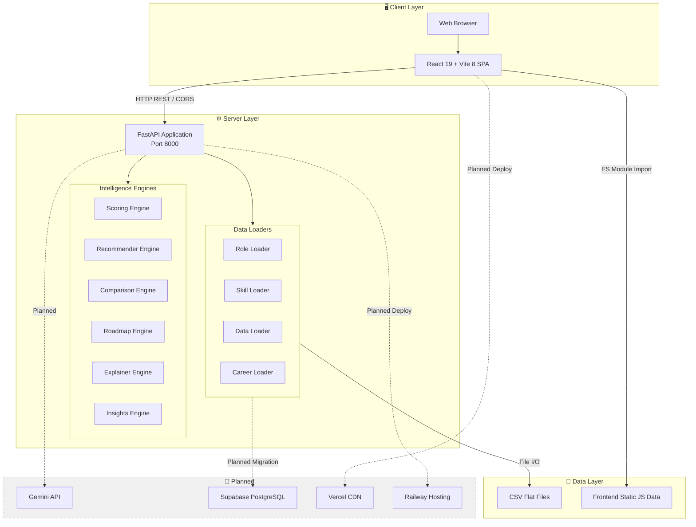
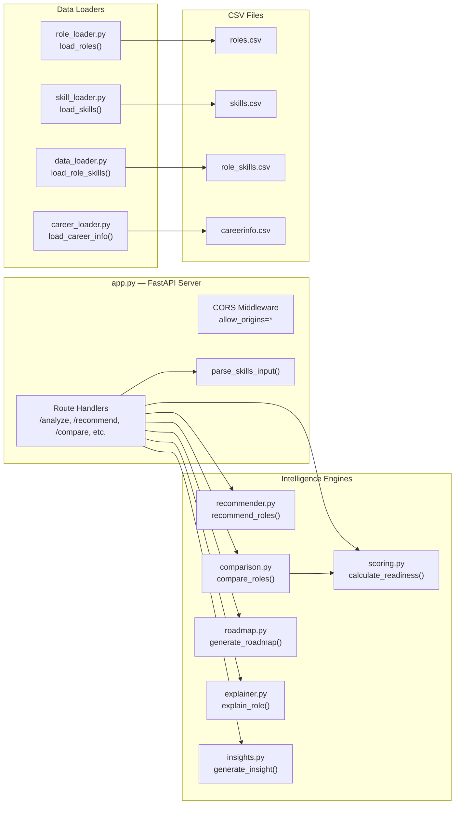
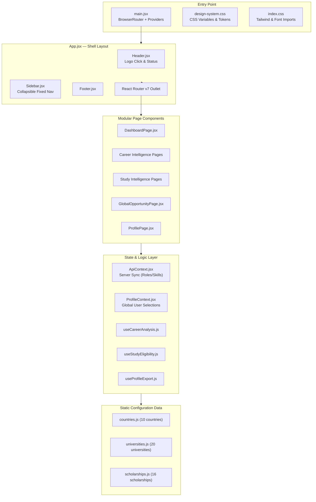
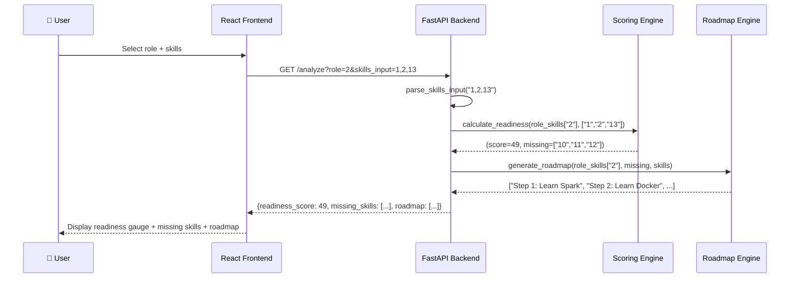
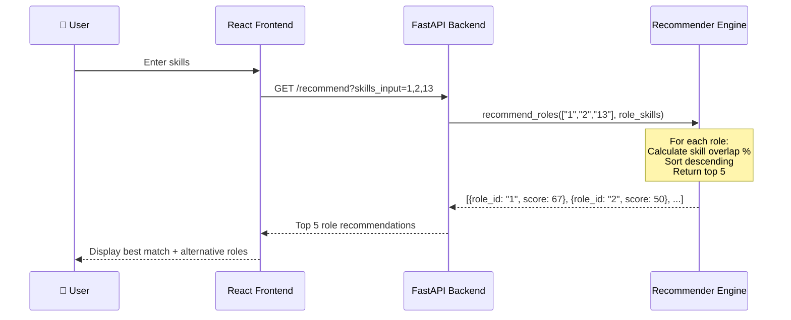
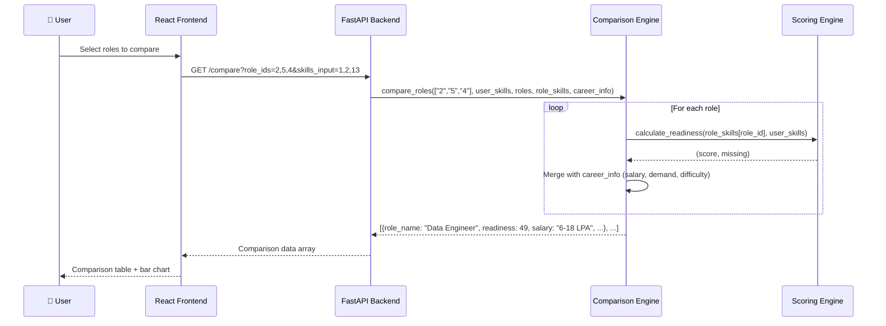
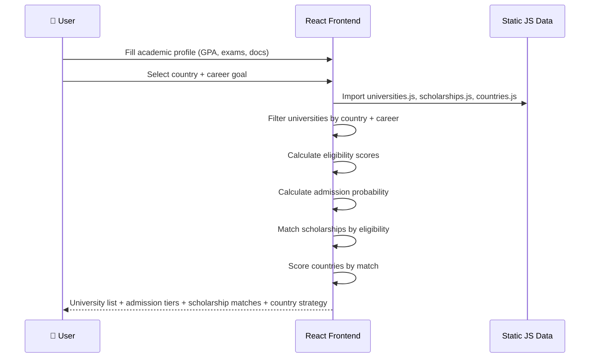
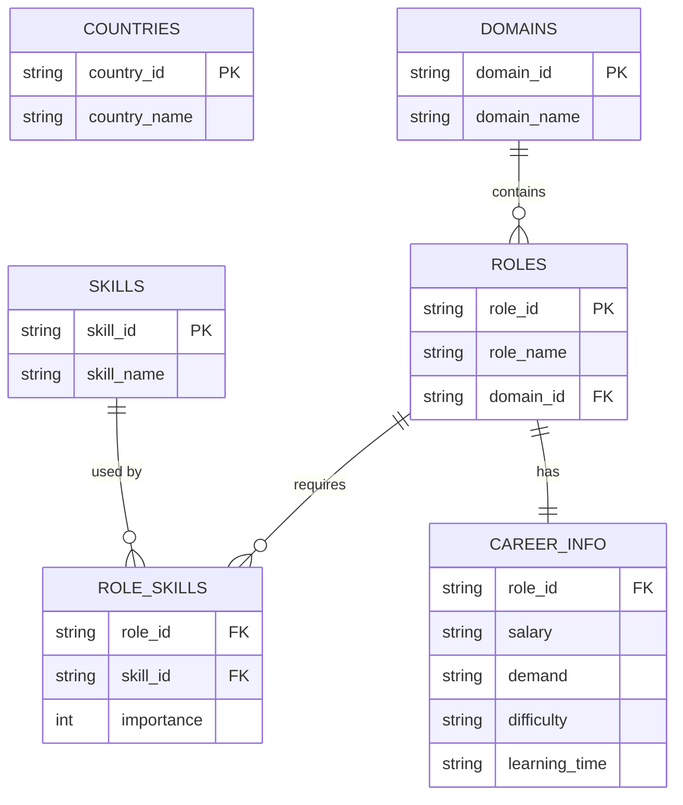
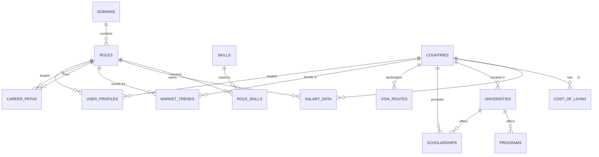
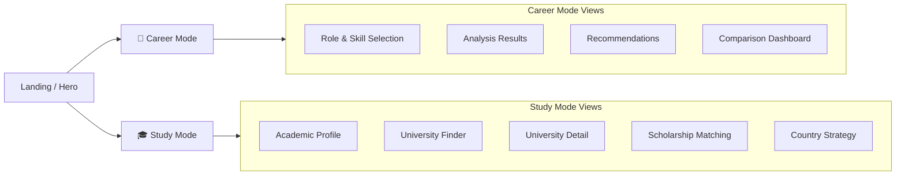

# 🏗️ Pathloom — System Design Document

> Version 1.0 · July 2026  
> Status: Living Document

---

## 1. System Overview

Pathloom is a three-tier web application following a **client-server architecture** with a React frontend consuming a Python FastAPI backend. Data is currently stored in CSV flat files, with a planned migration to PostgreSQL via Supabase.

---

## 2. High-Level Architecture

---

## 3. Component Architecture

### 3.1 Backend Components

**Key design decisions:**
- Data is loaded **once at startup** into memory — no per-request file I/O
- All engines are **pure functions** — no state, no side effects, easily testable
- `comparison.py` depends on `scoring.py` for per-role readiness calculation
- `insights.py` depends on `explainer.py` output for matched/missing skill context

### 3.2 Frontend Components

*Note:* The monolithic frontend has been fully decomposed into dedicated page files, layout containers, contexts, and business hooks. Routing is handled via React Router 7.

---

## 4. Data Flow Diagrams

### 4.1 Career Analysis Flow

### 4.2 Career Recommendation Flow

### 4.3 Career Comparison Flow

### 4.4 Study Intelligence Flow (Frontend-Only)

> **Note:** Study Intelligence currently runs entirely in the frontend with static JS data. No backend API calls are involved. This will change when the PostgreSQL migration is completed.

---

## 5. Data Architecture

### 5.1 Current Data Model (CSV)

### 5.2 Planned Data Model (PostgreSQL — 14 Tables)

> See [Data Dictionary](./DATA_DICTIONARY.md) for complete schema definitions.

---

## 6. API Architecture

### 6.1 Current Endpoints

| Endpoint | Method | Engine | Data Source |
|----------|--------|--------|-------------|
| `GET /` | GET | — | — |
| `GET /roles` | GET | RoleLoader | roles.csv |
| `GET /skills` | GET | SkillLoader | skills.csv |
| `GET /analyze` | GET | Scoring + Roadmap | role_skills.csv, skills.csv |
| `GET /recommend` | GET | Recommender | role_skills.csv |
| `GET /explain` | GET | Explainer | role_skills.csv, skills.csv |
| `GET /insight` | GET | Explainer + Insights | role_skills.csv, skills.csv |
| `GET /career-info/{role_id}` | GET | CareerLoader | careerinfo.csv |
| `GET /compare` | GET | Comparison + Scoring | role_skills.csv, careerinfo.csv |

### 6.2 Planned Endpoints

| Endpoint | Method | Description |
|----------|--------|-------------|
| `POST /resume/upload` | POST | Resume PDF upload and skill extraction |
| `POST /ai/chat` | POST | AI Career/Study Coach conversation |
| `GET /countries/{id}/intelligence` | GET | Country-level intelligence data |
| `GET /salary/{role}/{country}` | GET | Country-specific salary data |
| `GET /visa/{from}/{to}` | GET | Visa route planning |
| `GET /cost-of-living/{city}` | GET | City-level cost of living |
| `POST /ai/future-plan` | POST | AI Future Planner generation |
| `GET /market-trends` | GET | Market trend data |

> See [API Reference](./API_REFERENCE.md) for complete documentation.

---

## 7. Frontend Architecture

### 7.1 Design System: "Thread Gauge"

| Element | Value |
|---------|-------|
| **Display Font** | Space Grotesk |
| **Body Font** | IBM Plex Sans |
| **Mono Font** | IBM Plex Mono |
| **Canvas** | `#F5F6F9` |
| **Indigo** | `#232C52` |
| **Brass** | `#AD7F2C` |
| **Rust** | `#AE4F37` |
| **Teal** | `#1F6F61` |
| **Signature Visual** | Woven measuring tape progress bars |

### 7.2 Navigation Architecture

Currently implemented as mode toggle (no URL routing). React Router integration is planned for Phase 4.

---

## 8. Security Considerations

| Area | Current State | Plan |
|------|-------------|------|
| **CORS** | `allow_origins=["*"]` (open to all) | Restrict to specific domains in production |
| **Authentication** | None | Supabase Auth (email + OAuth) planned |
| **Authorization** | None (all data is public) | Row Level Security (RLS) defined in schema |
| **Input Validation** | Basic — skill IDs parsed, role IDs checked | Add Pydantic models for request validation |
| **Rate Limiting** | None | Add API rate limiting for AI endpoints |
| **HTTPS** | N/A (local dev) | Enforced by Vercel/Railway in production |
| **Environment Secrets** | `.env` file | Railway environment variables |

---

## 9. Performance Considerations

| Aspect | Current Approach | Future Optimization |
|--------|-----------------|-------------------|
| **Data Loading** | All CSVs loaded into memory at startup (~50KB total) | PostgreSQL with connection pooling |
| **API Response Time** | <10ms for all endpoints (in-memory computation) | May increase with DB queries; add caching layer |
| **Frontend Bundle** | Single monolithic App.jsx (~113KB) | Code splitting with React.lazy + React Router |
| **Static Data** | Study data embedded in JS modules | Move to API; implement pagination |
| **AI Responses** | Template strings (instant) | Gemini API calls (~1-3s); add streaming + caching |

---

> **Document Owner:** Pathloom Development Team  
> **Last Updated:** July 3, 2026
